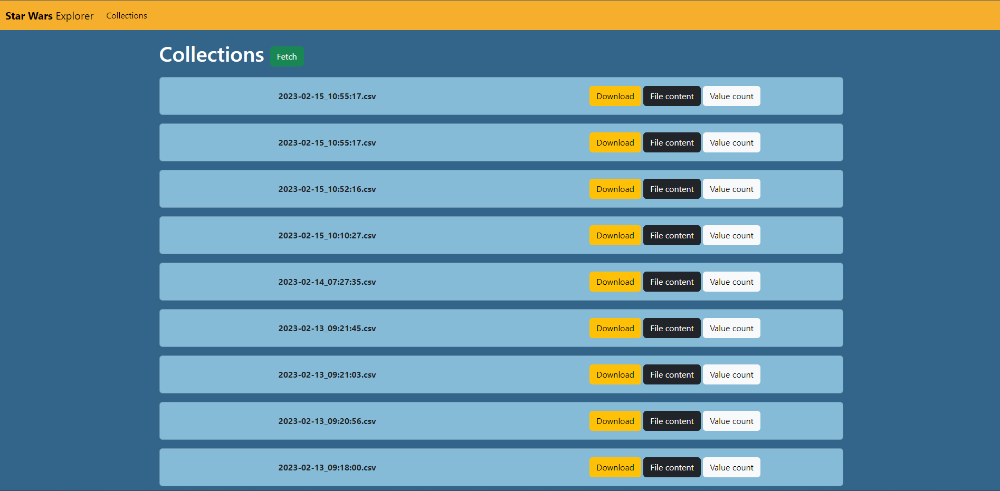
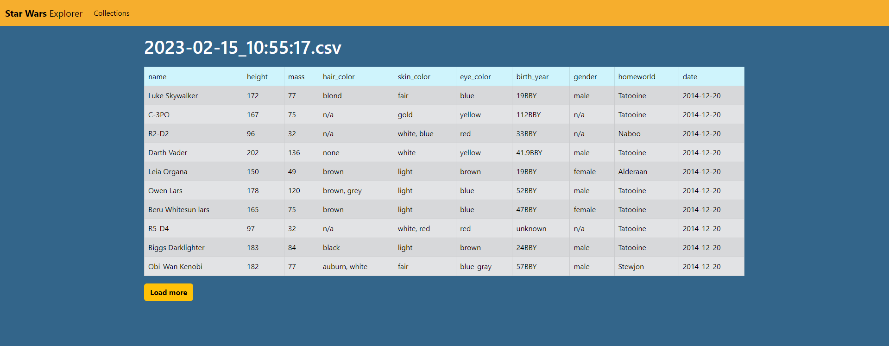
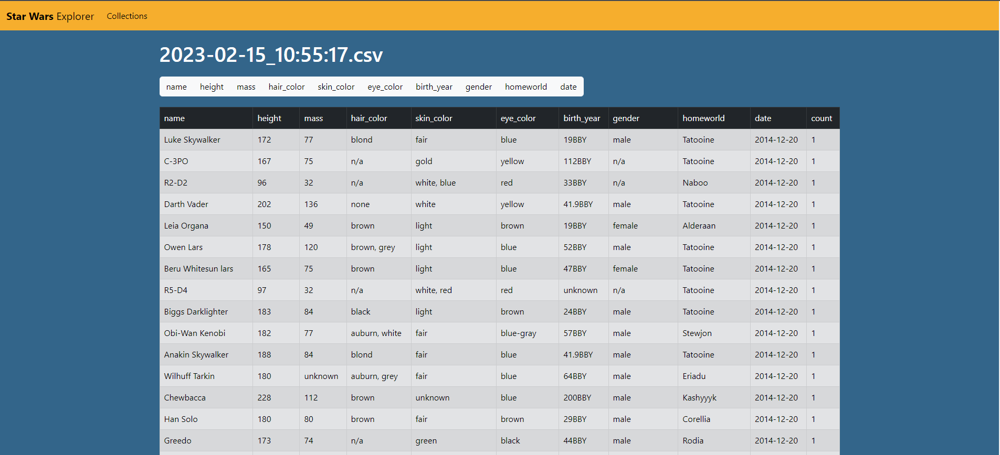
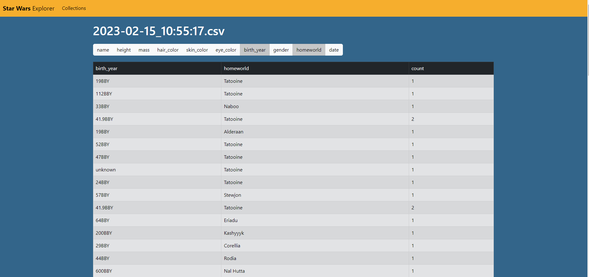

# StarWarsExplorer
Django application collecting, manipulating and displaying data collected from [SWAPI](https://swapi.dev/). 

## Functionalities
* Collecting data about Star Wars characters from SWAPI and save them in database as CSV files
* Downloading file from database
* View of content of file stored in database
* View of occurrences of selected values combinations in data file

## Table of contents
* [Technologies](#technologies)
* [Setup](#setup)
* [Features](#features)
* [Contact](#contact)

## Technologies
* Python 3.9.7
* Django 4.1.6
* requests 2.28.2
* petl 1.7.12

## Setup
To install and run app you will need to:
* Clone this repository to your computer or unpack .zip file in chosen directory,
* Run IDE or command line,
* Command in IDE to install demanded packages:
> pip install -r requirements.txt
* Go to project directory
> cd **{your_directory}**/sw_explorer
* Run database migrations
> python manage.py migrate
* Run local server
> python manage.py runserver
* Go to  http://127.0.0.1:8000/ in your browser

## Sections

### Home page

Contains list of files generated so far. New file can be generated by clicking **Fetch** button. Every single file has buttons to:
* **Download** - Download file from database
* **File content** - Display file content
* **Value count** - Display view with value counting functionality

### File content

Initially first 10 rows of CSV file are displayed in this view. To show more rows it's needed to click on **Load more** button. 

### Value count

This view displays count of combination of values selected by user. Initially all columns are displayed. 
To filter table click on buttons with column names above the table.

Initial view:

Filtered view:

## Contact
Created by [@matedawid](https://linkedin.com/in/matedawid) - if you have any questions, just contact me!
